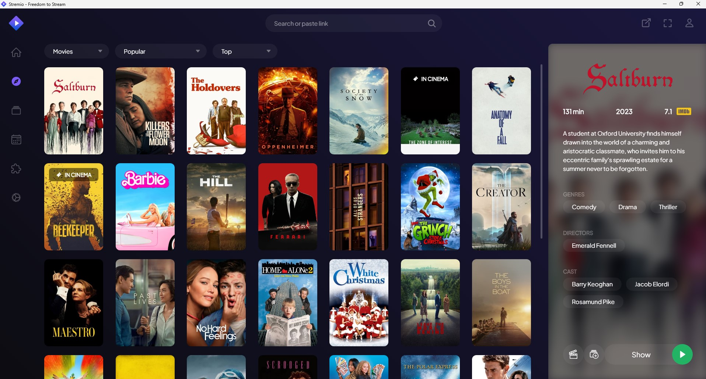

## Stremio Setup

|                                                           |
| ---------------------------------------------------------------------------------------------------- |
| Stremio is a free media center app that aggregates movies and tv shows, guiding the user on where to watch content                        |
| Torrentio is a service that agregates torrents across multiple different providers                                                     |
| Real-Debrid is a subscription-based service that allows users to download torrent data to a safe remote storage |

- Install the [Stremio Desktop App](https://www.stremio.com/downloads)
- Sign up for a [Stremio Account](https://www.stremio.com/register)
- Sign up for a [Real Debrid Account](https://real-debrid.com/)
- Subscribe to [Real Debrid Premium](https://real-debrid.com/premium)
- Configure [Torrentio](https://torrentio.strem.fun/configure)
  - Leave all of the settings as the default
  - Change the "Debrid Provider" to "RealDebrid"
  - Copy Your [API Key](https://real-debrid.com/apitoken)
  - Paste Your [API Key](https://real-debrid.com/apitoken) into [Torrentio](https://torrentio.strem.fun/configure) and press "Install"
- Done, you should now be able to stream anything within Stremio on any device
