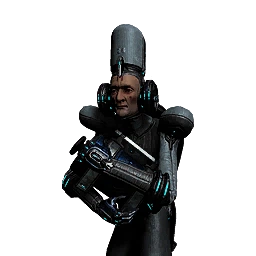
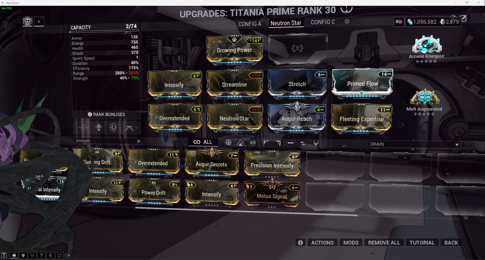

> 

<h2>Progenitor Warframe Table</h2>

>
> | TYPE                                                                                                                                                                                                                                                  | -                                                                                                                                                                                               | -                                                                                                                                                                                               | -                                                                                                                                                                                                         | -                                                                                                                                                                                                    | -                                                                                                                                                                                                    | -                                                                                                                                                                                               | -                                                                                                                                                                                               | -                                                                                                                                                                                          | -                                                                                                                                                                                          | -   |
> | ----------------------------------------------------------------------------------------------------------------------------------------------------------------------------------------------------------------------------------------------------- | ----------------------------------------------------------------------------------------------------------------------------------------------------------------------------------------------- | ----------------------------------------------------------------------------------------------------------------------------------------------------------------------------------------------- | --------------------------------------------------------------------------------------------------------------------------------------------------------------------------------------------------------- | ---------------------------------------------------------------------------------------------------------------------------------------------------------------------------------------------------- | ---------------------------------------------------------------------------------------------------------------------------------------------------------------------------------------------------- | ----------------------------------------------------------------------------------------------------------------------------------------------------------------------------------------------- | ----------------------------------------------------------------------------------------------------------------------------------------------------------------------------------------------- | ------------------------------------------------------------------------------------------------------------------------------------------------------------------------------------------ | ------------------------------------------------------------------------------------------------------------------------------------------------------------------------------------------ | --- |
> |  [Impact](/wiki/Damage/Impact_Damage)                          |  [Baruuk](/wiki/Baruuk)      |  [Gauss](/wiki/Gauss)           |  [Grendel](/wiki/Grendel)           |  [Rhino](/wiki/Rhino)                |  [Sevagoth](/wiki/Sevagoth) |  [Wukong](/wiki/Wukong)      |  [Zephyr](/wiki/Zephyr)      |
> |  [Heat](/wiki/Damage/Heat_Damage)                                    |  [Chroma](/wiki/Chroma)      |  [Ember](/wiki/Ember)           |  [Inaros](/wiki/Inaros)                |  [Kullervo](/wiki/Kullervo) |  [Nezha](/wiki/Nezha)                |  [Protea](/wiki/Protea)      |  [Vauban](/wiki/Vauban)      |  [Wisp](/wiki/Wisp)           |
> |  [Cold](/wiki/Damage/Cold_Damage)                                    |  [Frost](/wiki/Frost)           |  [Gara](/wiki/Gara)                |  [Hildryn](/wiki/Hildryn)           |  [Revenant](/wiki/Revenant) |  [Styanax](/wiki/Styanax)      |  [Titania](/wiki/Titania) |  [Trinity](/wiki/Trinity) |
> |  [Electricity](/wiki/Damage/Electricity_Damage) |  [Banshee](/wiki/Banshee) |  [Caliban](/wiki/Caliban)       |  [Excalibur](/wiki/Excalibur) |  [Gyre](/wiki/Gyre)                     |  [Limbo](/wiki/Limbo)                |  [Nova](/wiki/Nova)                |  [Valkyr](/wiki/Valkyr)      |  [Volt](/wiki/Volt)           |
> |  [Toxin](/wiki/Damage/Toxin_Damage)                               |  [Atlas](/wiki/Atlas)           |  [Dagath](/wiki/Dagath)      |  [Ivara](/wiki/Ivara)                     |  [Khora](/wiki/Khora)                |  [Nekros](/wiki/Nekros)           |  [Nidus](/wiki/Nidus)           |  [Oberon](/wiki/Oberon)      |  [Saryn](/wiki/Saryn)      |
> |  [Magnetic](/wiki/Damage/Magnetic_Damage)                |  [Citrine](/wiki/Citrine) |  [Harrow](/wiki/Harrow)      |  [Hydroid](/wiki/Hydroid)           |  [Lavos](/wiki/Lavos)                |  [Mag](/wiki/Mag)                          |  [Mesa](/wiki/Mesa)                |  [Xaku](/wiki/Xaku)                |  [Yareli](/wiki/Yareli) |
> |  [Radiation](/wiki/Damage/Radiation_Damage)           |  [Ash](/wiki/Ash)                     |  [Equinox](/wiki/Equinox) |  [Garuda](/wiki/Garuda)                |  [Loki](/wiki/Loki)                     |  [Mirage](/wiki/Mirage)           |  [Nyx](/wiki/Nyx)                     |  [Octavia](/wiki/Octavia) |  [Qorvex](/wiki/Qorvex) |  [Voruna](/wiki/Voruna) |
>
> 

>
> ---
>
> 

<h2>Kuva Lich Weapons</h2>

>
> > 

<h3>Selecting a Kuva Lich weapon</h3>

> >
> > - Finish The War Within quest to unlock Kuva Liches
> > - If you're farming for a specific weapon, choose a Progenitor Warframe based on the table above
> > - Start a Level 20+ Grineer Mission. Cassini Capture on Saturn is popular
> >   - The timer starts when the light flicker, this can be immediately on start or during the mission
> >     - On Capture missions, the lights wont flicker until after the mission target has been successfully captured
> > - Kill 10 Grineer within 1 minute to trigger a Kuva Larvaling (Below)
> > - When a Kuva Larvaling is killed they will display a weapon above their head
> >   - If its the weapon you want, hold Q to execute the Lich, complete the mission and extract normally
> >   - If its not the weapon you want, complete the Mission and extract normally to try again
> >
> > 

> >
> > ---
> >
> > 

<h3>Unlocking the Kuva Lich weapon</h3>

> >
> > - On creation of a Kuva Lich, they generate a random passphrase of 3 different Requiems
> > - To spawn the Lich, you'll need to execute thralls in Kuva Lich missions
> > - Players must slot the matching Requiem Mods in their Parazon and defeat the Lich until they find the correct order
> > - Start on Earth, select any mission with the Lich icon (higher level)
> > - Play through the missions, executing thralls along the way to draw out your Kuva Lich
> > - Once your Kuva Lich has spawned:
> >   - Down the Kuva Lich without executing until you've revealed your first 2 Requiem Murmurs
> >   - Slot the 2 known murmurs in the first 2 slots and an Oull (wildcard) in the third slot
> >   - Down the Kuva Lich and execute it
> >     - If the first mod is wrong, swap it with the second slot
> >     - If the first mod is right and the second mod is wrong, swap the second mod to the third slot
> >   - Down the Kuva Lich and execute it
> >     - If the first mod is wrong, swap it with the third slot
> >   - Down the Kuva Lich and execute it
> >     - You should now have all 3 mods in the correct order
> >
> > 

> >
> > ---
> >
> > 

<h3>Buying a Kuva Lich contract</h3>

> >
> > - You can buy Kuva Lich contracts on [Warframe.Market](https://warframe.market/auctions) to skip the Larvaling farm
> >   - Find the Lich you want to buy
> >   - Meet the seller in the Crimson Branch room of a Dojo
> >   - Complete the trade to activate the Lich
> >
> > 

> >
> > ---
> >
> > 

<h3>Kuva Lich Images</h3>

> >
> > |                         Male Larvaling                         |                         Female Larvaling                         |
> > | :------------------------------------------------------------: | :--------------------------------------------------------------: |
> > |  |  |
> >
> > 

>
> 

>
> ---
>
> 

<h2>Sisters Of Parvos Weapons</h2>

>
> > 

<h3>Selecting a Tenet Weapon</h3>

> >
> > - Finish The War Within and Call of the Tempestarii questlines
> > - If you're farming for a specific weapon, choose a Progenitor Warframe based on the table above
> > - Start a Level 20+ Corpus Mission. Hydra Capture on Pluto is popular
> > - Find the Granum Void (Golden Hand) and start a Zenith Crown
> >   - If you don't have a Zenith Crown, wait 3 to 6 minutes for a Treasurer to spawn and kill them to gain one
> > - Complete the Granum Void to spawn a Candidate
> > - When a Candidate is killed they will display a weapon above their head
> >   - If its the weapon you want, hold Q to execute the candidate, complete the mission and extract normally
> >   - If its not the weapon you want, complete the Mission and extract normally to try again
> >
> > 

> >
> > ---
> >
> > 

<h3>Unlocking a Tenet Weapon</h3>

> >
> > - On creation of a Sister, they generate a random passphrase of 3 different Requiems
> > - To spawn the Sister, you'll need to execute hounds in Sister missions
> > - Players must slot the matching Requiem Mods in their Parazon and defeat the Sister until they find the correct order
> > - Start on Earth, select any mission with the Sister icon (higher level)
> > - Play through the missions, executing hounds along the way to draw out your Sister
> > - Once your Sister has spawned:
> >   - Down the Sister without executing until you've revealed your first 2 Requiem Murmurs
> >   - Slot the 2 known murmurs in the first 2 slots and an Oull (wildcard) in the third slot
> >   - Down the Sister and execute it
> >     - If the first mod is wrong, swap it with the second slot
> >     - If the first mod is right and the second mod is wrong, swap the second mod to the third slot
> >   - Down the Sister and execute it
> >     - If the first mod is wrong, swap it with the third slot
> >   - Down the Sister and execute it
> >     - You should now have all 3 mods in the correct order
> >
> > 

> >
> > ---
> >
> > 

<h3>Buying a candidate contract</h3>

> >
> > - You can buy candidate contracts on [Warframe.Market](https://warframe.market/auctions) to skip the candidate farm
> >   - Find the candidate you want to buy
> >   - Meet the seller in the Crimson Branch room of a Dojo
> >   - Complete the trade to activate the candidate
> >
> > 

> >
> > ---
> >
> > 

<h3>Sisters Of Parvos Images</h3>

> >
> > |                           Treasurer                           |                          Zenith Granum Crown                          |                         Granum Void Hand Tribute                          |
> > | :-----------------------------------------------------------: | :-------------------------------------------------------------------: | :-----------------------------------------------------------------------: |
> > |  |  |  |
> >
> > 

>
> 

>
> ---
>
> 

<h2>Incarnon Weapons and Genesis</h2>

>
> > 

<h3>Incarnon Weapons</h3>

> >
> > - Finish the "Angels of the Zariman" questline to unlock access to Incarnon weapons.
> > - Visit Cavalero located in the Chrysalith aboard the Zariman. He is the vendor for Incarnon weapons.
> > - Exchange Holdfasts, a form of standing earned through Zariman activities, for Incarnon weapons with Cavalero.
> >
> > 

> >
> > ---
> >
> > 

<h3>Incarnon Genesis</h3>

> >
> > - Review the [Reward Rotation](https://warframe.fandom.com/wiki/Incarnon#Reward_Rotation) to know which Genesis Adapters are available that week.
> > - From the Orbiter's star chart, locate and click the Duvari icon (resembles a metal head) at the top right corner to open the Duvari menu.
> > - Within the Duvari menu, choose two Genesis Adapters you wish to aim for during the week
> > - Complete "The Circuit" missions on the Steel Path difficulty level to earn Genesis Adapters as rewards, specifically at the 5th and 10th tiers.
> > - After receiving a Incarnon Genesis Adapter, visit Cavalero located in the Chrysalith aboard the Zariman to Evolve your weapons
> >
> > 

>
> 

>
> ---
>
> 

<h2>Helminth Farming Locations</h2>

>
> > 

<h3>Bile</h3>

> >
> > | Resource                    | Best Farming Location(s)                            | Additional Notes                                                                                                        |
> > | --------------------------- | --------------------------------------------------- | ----------------------------------------------------------------------------------------------------------------------- |
> > | Aggristone                  | -                                                   | -                                                                                                                       |
> > | Ariette Scale               | -                                                   | -                                                                                                                       |
> > | Antiserum Injector Fragment | Infested Salvage missions (Oestrus, Eris)           | Use Nekros with Desecrate, Hydroid with Pilfering Swarm, or Khora with Pilfering Strangledome for increased drop rates. |
> > | Argon Crystal               | Void missions (any)                                 | Best farmed in missions like Capture for quick runs. Argon Crystals decay over time, so use them quickly.               |
> > | Cryotic                     | Excavation missions (any planet)                    | Longer missions yield more Cryotic. Consider using frames like Frost, Limbo, or Gara for defense.                       |
> > | Diluted Thermia             | Thermia Fractures on Orb Vallis (Venus)             | Available during the "Operation: Buried Debts" event. Collect and close Thermia Fractures.                              |
> > | Enigma Gyrum                | -                                                   | -                                                                                                                       |
> > | Isos                        | Railjack missions, specifically in the Veil Proxima | Farming in higher-level Railjack missions increases the drop rate.                                                      |
> > | Javlok Capacitor            | Incursions in the Plains of Eidolon (Earth)         | Random drop from enemy units during Incursions.                                                                         |
> > | Morphics                    | Mars, Mercury, Pluto, and Europa                    | War, Mars and Apollodorus, Mercury are good farming spots. Use frames with loot abilities for better efficiency.        |
> > | Nav Coordinate              | Assassination missions, Orokin Derelict missions    | Common in the reward pool for these mission types.                                                                      |
> > | Omega Isotope               | Planets where a Fomorian event is active            | Drop from any mission on a planet under invasion.                                                                       |
> > | Orokin Cipher               | Orokin Derelict Vaults                              | Requires a Dragon Key to access vaults. Random chance to obtain Ciphers from the vaults.                                |
> > | Rune Marrow                 | -                                                   | -                                                                                                                       |
> > | Somatic Fibers              | Lua (The Moon)                                      | Drops from Sentients. Farming during missions like Crossfire Exterminate can yield good results.                        |
> > | Thermal Sludge              | Orb Vallis (Venus)                                  | Found in containers and as environmental pickups. Good spots are around the outskirts of Fortuna and industrial areas.  |
> > | Ticor Plate                 | Railjack missions, specifically in the Veil Proxima | Higher-level Railjack missions have a better drop rate.                                                                 |
> > | Vainthorn                   | -                                                   | -                                                                                                                       |
> > | Voidgel Orb                 | Void Storm missions in Railjack                     | Drops from enemies and crates during Void Storms.                                                                       |
> >
> > 

> >
> > ---
> >
> > 

<h3>Biotics</h3>

> >
> > | Resource             | Best Farming Location(s)                       | Additional Notes                                             |
> > | -------------------- | ---------------------------------------------- | ------------------------------------------------------------ |
> > | Connla Sprout        | Cambion Drift (Deimos)                         | Found in the wild, especially around bodies of water.        |
> > | Dracroot             | Cambion Drift (Deimos)                         | Commonly found in the wild across Deimos.                    |
> > | Dusklight Sarracenia | Ceres, in swampy waters                        | Best found in the Grineer Shipyard missions.                 |
> > | Eevani               | -                                              | -                                                            |
> > | Frostleaf            | On the ground in any cold environment on Venus | Look around the edges of cliffs and in open areas.           |
> > | Ganglion             | Cambion Drift (Deimos)                         | Dropped by Deimos enemies and found in the environment.      |
> > | Gorgaricus Spore     | Orb Vallis (Venus)                             | Found in caves and around mushroom patches.                  |
> > | Kovnik               | -                                              | -                                                            |
> > | Lunar Pitcher        | Lua                                            | Spawns in and around the Orokin structures.                  |
> > | Maprico              | Plains of Eidolon (Earth)                      | Found on trees in the Plains.                                |
> > | Moonlight Dragonlily | Plains of Eidolon (Earth) - night              | Found near water bodies during the night.                    |
> > | Moonlight Jadeleaf   | Plains of Eidolon (Earth) - night              | Grows in grassy areas during the night.                      |
> > | Moonlight Threshcone | Plains of Eidolon (Earth) - night              | Found in forested areas during the night.                    |
> > | Mytocardia Spore     | Orb Vallis (Venus)                             | Found in the caves of Orb Vallis.                            |
> > | Nistlepod            | Plains of Eidolon (Earth)                      | Grows on trees, especially near Grineer outposts.            |
> > | Pustulite            | Cambion Drift (Deimos)                         | Dropped by enemies and found in the environment.             |
> > | Ruk's Claw           | Grineer Asteroid missions (e.g., Mars)         | Grows in patches on the ground in Grineer Asteroid tilesets. |
> > | Silphsela            | -                                              | -                                                            |
> > | Sunlight Dragonlily  | Plains of Eidolon (Earth) - day                | Found near water bodies during the day.                      |
> > | Sunlight Jadeleaf    | Plains of Eidolon (Earth) - day                | Grows in grassy areas during the day.                        |
> > | Sunlight Threshcone  | Plains of Eidolon (Earth) - day                | Found in forested areas during the day.                      |
> > | Tasoma Extract       | -                                              | -                                                            |
> > | Tepa Nodule          | Cambion Drift (Deimos)                         | Found in the wild, often in areas with infestation presence. |
> > | Ueymag               | -                                              | -                                                            |
> > | Vestan Moss          | Asteroid missions, like those on Mercury       | Look on shaded rock walls in outdoor areas.                  |
> > | Yao Shrub            | -                                              | -                                                            |
> >
> > 

> >
> > ---
> >
> > 

<h3>Calx</h3>

> >
> > | Resource                | Best Farming Location(s)                             | Additional Notes                                                                                                      |
> > | ----------------------- | ---------------------------------------------------- | --------------------------------------------------------------------------------------------------------------------- |
> > | Asterite                | Railjack missions, particularly in the Veil Proxima  | Farming in higher-level Railjack missions increases the drop rate.                                                    |
> > | Belric Crystal Fragment | -                                                    | -                                                                                                                     |
> > | Cubic Diodes            | Corpus Ship missions, especially on Europa           | Dropped by Eximus units on Corpus ships. Best farmed during Eximus Stronghold Sortie missions for higher spawn rates. |
> > | Gallos Rods             | Railjack missions, particularly around Earth Proxima | Found in containers and as drops from enemies in Railjack missions.                                                   |
> > | Grokdrul                | Plains of Eidolon (Earth)                            | Can be collected from Grokdrul Drums in Grineer camps.                                                                |
> > | Hexenon                 | Jupiter, especially the Gas City rework tileset      | Farmable from enemies and containers on Jupiter. Io, Jupiter is a popular spot for Hexenon farming.                   |
> > | Iradite                 | Plains of Eidolon (Earth)                            | Found in the wild, especially in higher-level areas of the Plains. Break iradite formations.                          |
> > | Lucent Teroglobe        | Cambion Drift (Deimos)                               | Dropped by enemies and found in the environment.                                                                      |
> > | Nacreous Pebble         | -                                                    | -                                                                                                                     |
> > | Nullstones              | Void missions                                        | Dropped by enemies and found in containers within the Void.                                                           |
> > | Rania Crystal Fragment  | -                                                    | -                                                                                                                     |
> > | Rubedo                  | Phobos, Earth, Pluto, Europa, Sedna, and Orokin Void | Higher drop rates in Void missions. Tycho, Lua is also a popular spot due to high enemy density.                      |
> >
> > 

> >
> > ---
> >
> > 

<h3>Oxides</h3>

> >
> > | Resource    | Best Farming Location(s)                                            | Additional Notes                                                                                               |
> > | ----------- | ------------------------------------------------------------------- | -------------------------------------------------------------------------------------------------------------- |
> > | Alloy Plate | Venus, Ceres, Jupiter, Sedna                                        | Can be efficiently farmed in missions with high enemy density, such as Defense and Survival missions.          |
> > | Carbides    | Shipyard missions on Ceres, particularly against the Grineer        | Dropped by Eximus units on Ceres. Best farmed during Eximus Stronghold Sortie missions for higher spawn rates. |
> > | Ferrite     | Mercury, Earth, Neptune, Orokin Void                                | High quantities can be found in Void missions. Capture missions are quick and can yield a good amount.         |
> > | Gallium     | Mars, Uranus                                                        | Low drop rate but can be farmed efficiently on Uranus due to a higher number of boss and rare enemy spawns.    |
> > | Maw Fang    | -                                                                   | -                                                                                                              |
> > | Oxium       | Corpus missions, especially on Jupiter and Pluto                    | Oxium Ospreys are the primary source. Io, Jupiter is a popular farming location.                               |
> > | Salvage     | Mars, Jupiter, Sedna                                                | Large quantities can be gathered in endless missions on these planets.                                         |
> > | Tellurium   | Ophelia on Uranus                                                   | Rare resource that can drop in Archwing missions or Uranus Sealab tiles.                                       |
> > | Titanium    | Railjack missions, particularly in Earth Proxima and Saturn Proxima | Farming in Railjack missions yields a good amount. Breaking down wreckage also grants Titanium.                |
> >
> > 

> >
> > ---
> >
> > 

<h3>Pheromones</h3>

> >
> > | Resource            | Best Farming Location(s)                       | Additional Notes                                                                                |
> > | ------------------- | ---------------------------------------------- | ----------------------------------------------------------------------------------------------- |
> > | Chitinous Husk      | Cambion Drift (Deimos)                         | Dropped by Deimos enemies, particularly the tougher variants.                                   |
> > | Infected Palpators  | Cambion Drift (Deimos)                         | Dropped by infested enemies on Deimos.                                                          |
> > | Lamentus            | -                                              | -                                                                                               |
> > | Mutagen Sample      | Orokin Derelict, Eris, Deimos                  | Best farmed in the Orokin Derelict and Eris. Clan Dojo research resource.                       |
> > | Nano Spores         | Saturn, Neptune, Eris, Orokin Derelict         | High quantities can be farmed in Survival, Defense, or Infested Salvage missions.               |
> > | Neurodes            | Earth, Eris, Lua, Deimos                       | Lua's Plato mission is a popular spot due to frequent Eximus spawns.                            |
> > | Plastids            | Saturn, Uranus, Phobos, Pluto, Eris            | Survival missions on Saturn and Uranus are good for farming Plastids.                           |
> > | Pulsating Tubercles | Cambion Drift (Deimos)                         | Dropped by Deimos enemies. Rare resource.                                                       |
> > | Severed Bile Sac    | Cambion Drift (Deimos)                         | Dropped by Deimos enemies. Rare resource.                                                       |
> > | Thrax Plasm         | Zariman Ten Zero                               | Dropped by enemies in Zariman missions.                                                         |
> > | Lua Thrax Plasm     | Lua, during Zariman-related missions or events | A variant of Thrax Plasm, specific to Lua during certain missions or events related to Zariman. |
> >
> > 

> >
> > ---
> >
> > 

<h3>Synthetics</h3>

> >
> > | Resource          | Best Farming Location(s)                                                  | Additional Notes                                                                                    |
> > | ----------------- | ------------------------------------------------------------------------- | --------------------------------------------------------------------------------------------------- |
> > | Aucrux Capacitors | -                                                                         | -                                                                                                   |
> > | Circuits          | Venus, Ceres, Kuva Fortress                                               | Endless missions on these planets can provide a steady supply.                                      |
> > | Control Module    | Neptune, Europa, Void                                                     | The Void is a reliable source, with missions like Survival and Defense being particularly fruitful. |
> > | Cryptographic ALU | Corpus Ship Sabotage missions (Ice Planet) during Razorback Armada events | Obtained by destroying Corpus Ship security nodes. Only drops during the Razorback Armada invasion. |
> > | Detonite Ampule   | Grineer missions                                                          | Common drop from Grineer enemies.                                                                   |
> > | Entrati Lanthorn  | -                                                                         | -                                                                                                   |
> > | Fieldron Sample   | Corpus missions                                                           | Common drop from Corpus enemies.                                                                    |
> > | Komms             | -                                                                         | -                                                                                                   |
> > | Neural Sensors    | Jupiter, Kuva Fortress                                                    | Alad V on Jupiter is a popular boss for Neural Sensor farming.                                      |
> > | Orokin Cell       | Tethys on Saturn                                                          | Sargas Ruk on Saturn, dies fast to Ignis Wraith                                                     |
> > | Polymer Bundle    | Mercury, Venus, Uranus                                                    | Dark Sector missions on Uranus, such as Assur, offer increased drop rates.                          |
> > | Saggen Pearl      | Cambion Drift (Deimos)                                                    | Found in the wild, particularly in the exocrine of Deimos. Rare resource.                           |
> >
> > 

> >
> > ---
> >
> > 

<h3>Sentient Ap3etite</h2>

> >
> > | Resource                  | Best Farming Location(s)                                                   | Additional Notes                                                                                                      |
> > | ------------------------- | -------------------------------------------------------------------------- | --------------------------------------------------------------------------------------------------------------------- |
> > | Anomaly Shard             | Veil Proxima during Sentient Anomaly in the Railjack missions              | Anomaly Shards are collected from the Sentient Ship that appears in the Veil Proxima for a limited time.              |
> > | Cetus Wisp                | Plains of Eidolon near bodies of water                                     | Best farmed at night or using a loot radar to spot them more easily. They spawn around the edges of lakes and ponds.  |
> > | Intact Sentient Core      | Plains of Eidolon from Vomvalysts and other Sentient enemies               | Commonly dropped by Vomvalysts upon defeat. Nighttime on the Plains is the best time to farm these.                   |
> > | Exceptional Sentient Core | Plains of Eidolon from Sentient enemies                                    | Higher chance of drop from stronger Sentients encountered during nighttime or within the Lua missions.                |
> > | Flawless Sentient Core    | Plains of Eidolon from Sentient enemies, particularly during Eidolon hunts | Dropped by stronger Sentient enemies; Eidolon Teralyst, Gantulyst, and Hydrolyst hunts provide these more frequently. |
> > | Eidolon Shard             | Plains of Eidolon from Eidolon Teralyst, Gantulyst, Hydrolyst              | Obtained by defeating Eidolons on the Plains of Eidolon. Requires completion of The War Within quest to collect.      |
> >
> > 

> >
> > ---
>
> 

>
> ---
>
> 

<h2>Arcon Shards</h2>

>
> A permanent upgrade item taken from Archons and used by the Helminth to further enhance a Warframe
>
> - Complete the Veilbreaker quest
> - Install the Helminth Archon Shard Segment
> - Archon Shards are awarded from Archon Hunts (1), Netracell (5) and Chipper (1)
> - Archon Hunts are multi-stage missions in a battle against Narmer forces to defeat Pazuul's Archons, accessed from the archon hunts tab on the star chart
> - Netracell is a repeatable mission that can be replayed up to 5 times per week for rewards
> - Chipper is a merchant that appears in the Drifter Camp after reaching Rank 2 with the Kahl's Garrison Syndicate. Archon Shards become available in their shop after reaching Rank 5 with the Kahl's Garrison syndicate. Cost 90 Stock.
> - Archon Shards have an 80% chance of being a normal variant and 20% of being Tauforged
>   - Topaz, Violet, and Emerald Archon Shards are only obtainable through Coalescent Fusion
>     - Topaz: Crimson + Amber
>     - Violet: Crimson + Azure
>     - Emerald: Amber + Azure
>
> 

>
> ---
>
> 

<h2>Titania Loot Box Farming</h2>

>
> - Subsume Nova's Null Star ability onto Titania
> - Equip the Neutron Star augment mod (this is how we break boxes)
> - Build for +Range and Efficiency
>   - 175 Efficiency
>   - 265 Range (Companion Vacuum is 11.5M, Neutron Star is 21.2M)
>   - 70% Strength (Needed to break boxes in a single cast)
> - Use Razorwing to keep moving while you cast Null Star to break boxes
>   
>
> 

>
> ---
>
> 

<h2>Alecaframe - Warframe companion app</h2>

>
> > 

<h3>Installing Alecaframe</h3>

> >
> > Alecaframe is a companion app for warframe that makes it easier to track your progress, increase your mastery rank and craft, buy and sell items.
> >
> > - Install [Alecaframe](https://www.alecaframe.com/)
> > - Link your [Warframe.Market](Warframe.Market) account in the settings
> > - Launch Warframe and ensure your progress is sync'd with Alecaframe
> >
> > 

> >
> > ---
> >
> > 

<h3>Debloating Overwolf</h3>

> >
> > Overwolf is an addon platform that works with developers to ensure mods are TOS compliant and not bannable. The drawback of Overwolf is that it is resource heavy and using tracking and advertising within its overlay. Luckily, we can mitigate most of this by blocking its access to the internet. For this, we'll use "Simplewall", which is a free open-source extension of the native windows firewall that allows us to quickly allow/deny specific applcations internet access.
> >
> > - Fully close out of Alecaframe and Overwolf, ensure its not running on the taskbar and task manager
> > - Install [Simplewall](https://github.com/henrypp/simplewall/releases)
> > - In Simplewall, click the "Enable Filters" button
> > - Once enabled, a notification will be displayed any time a new application tries to access the internet for the first time
> > - Launch Overwolf and the Alecaframe addon
> > - When any Overwolf component requests internet access, you can permantently deny it
> > - Ensure "Alecaframe.exe" is granted access when it requests. If you block it by mistake you can Allow it form the list in Simplewall.
> >
> > 

>
> 

>
> ---
>
> 

<h2>Arcane Mod Farming</h2>

>
> - Zariman, Tuvul Commons, Void Cascade Mission Type
> - Farm Thrax enemies to drop Arcanes using a Mod Drop Chance Booster
> - Mod Drop Chance Booster is a 3-day booster can be obtained as a reward from Sorties, Archon Hunts, and the Steel Path track of The Circuit
> - It's also offered as a periodic item for sale by Baro Ki'Teer, costing 500 Orokin Ducats and 175,000 to purchase
> - Buy Arcanes using Cavalero Standing
> - Dissolve junk arcanes for Vosfor
> - Trade Vosfor to Loid for Arcanes
> - Rank Up Arcanes
>
> 

>
> ---
>
> 

<h2>Kahl Garrison Missions</h2>

>
> > 

<h3>Sneaky Sabotage Speedrun</h2>

> >
> > |                                                                                                                                                                   |
> > | ----------------------------------------------------------------------------------------------------------------------------------------------------------------- |
> > | Console (Marked) &emsp;\|&emsp; Deactivate Right Barrier                                                                                                          |
> > | Console (Marked) &emsp;\|&emsp; Deactivate Left Magnalock &emsp;\|&emsp; Deactivate Right Barrier &emsp;\|&emsp; Change To Right Camera                           |
> > | Deactivate Left Barrier &emsp;\|&emsp; Exit                                                                                                                       |
> > | Exit Door &emsp;\|&emsp; Turn Left &emsp;\|&emsp; Jump Over Railing &emsp;\|&emsp;                                                                                |
> > | Stairs Immediately To The Right &emsp;\|&emsp; Hack Console &emsp;\|&emsp; Jump Down &emsp;\|&emsp; Left Door                                                     |
> > | Console &emsp;\|&emsp; Deactivate Barrier &emsp;\|&emsp; Exit Room &emsp;\|&emsp; Turn Right                                                                      |
> > | Go Up Stairs &emsp;\|&emsp; Turn Right &emsp;\|&emsp; Go Down Stairs &emsp;\|&emsp; Jump Over Railing                                                             |
> > | Continue Straight &emsp;\|&emsp; Down Stairs &emsp;\|&emsp; Up Stairs &emsp;\|&emsp; Hack Console                                                                 |
> > | Turn Left &emsp;\|&emsp; Jump Railing &emsp;\|&emsp; Climb Wall &emsp;\|&emsp; Fall Down                                                                          |
> > | Hack Console &emsp;\|&emsp; Turn Left &emsp;\|&emsp; Activate Elevator &emsp;\|&emsp; Run Towards Blinking Light                                                  |
> > | Continue Straight To Room &emsp;\|&emsp; Activate Console &emsp;\|&emsp; Deactivate Barrier &emsp;\|&emsp; 180° Deactivate Magnalock                              |
> > | Run To Marked Console &emsp;\|&emsp; Hack Console &emsp;\|&emsp; Run On Left Sloped Wall &emsp;\|&emsp; Double Jump Up To High Ledge                              |
> > | Follow Sstairs On Left &emsp;\|&emsp; Enter Room On Left &emsp;\|&emsp; Activate Console &emsp;\|&emsp;                                                           |
> > | Right Camera &emsp;\|&emsp; Up Activate Drone &emsp;\|&emsp; Change Symbols To Match Their Connected Door Symbol (Follow Lines) &emsp;\|&emsp; Run Boot Sequence  |
> > | Exit &emsp;\|&emsp; Grab Gun &emsp;\|&emsp; Move To 60m Marked Objective &emsp;\|&emsp; Activate Console                                                          |
> > | Turn Right &emsp;\|&emsp; Keep Running Staight To Far End Of Long Hall &emsp;\|&emsp; Freeze Boss With Barrel &emsp;\|&emsp; Repeat Each Phase: G, 1, 1, 3, Shoot |
> >
> > 

>
> 

>
> ---
>
> 

<h2>Companion Hunting</h2>

>
> > 

<h3>Predasite and Vulpaphyla</h2>

> >
> > - Purchase Tranq Rifle, Predasite Lure and Vulpaphyla Lure
> > - Equip Tranq Rifle, Open Map, Track Target
> > - Start Tracking, Follow Footprints, Find "Call Point"
> > - Equip Lure, Call To Attract (no skill check), wait for response, face direction of response
> > - Call again (skill check), Tranq target, Capture
> >   - To capture a "weakened" version of the target, you need to have an infested enemy attack the target before you capture
> >     - option 1: shoot an infested before the target spawns and lead them to the target
> >     - option 2: tranq the target, then bring infested to the target before you capture
> >
> > 

>
> 

>
> ---
>
> 

<h2>Vendor Weapon Mastery</h2>

>
> > 

<h3>Cetus - Plains of Eidolon (Earth)</h3>

> >
> > - Hok's Anvil: Hok offers Zaw components, which can be assembled into melee weapons
> >   - Resources Required: Ostron Standing, plus various resources found in the Plains of Eidolon like Fish Parts, Ores, and Wisps.
> > - The Quills: Offers Amp parts used to assemble Amps for your Operator. Each unique Amp configuration contributes to Mastery.
> >   - Resources Required: Quill Standing, Sentient Cores.
> >
> > 

> >
> > ---
> >
> > 

<h3>Fortuna - Orb Vallis (Venus)</h3>

> >
> > - Rude Zuud's: Sells Kitgun components, which can be combined into custom secondary weapons.
> >   - Resources Required: Solaris United Standing, plus Fortuna resources like Gems and Fish Parts.
> > - Legs: Offers MOA companions, with each unique MOA chassis contributing to Mastery.
> >   - Resources Required: Solaris United Standing, plus specific resources found in Orb Vallis.
> > - Little Duck: Provides components for Railjack, Amp upgrades and Arcanes for Operators. While not all items directly contribute to Mastery, Amp parts do.
> >   - Resources Required: Vox Solaris Standing, Toroids.
> >
> > 

> >
> > ---
> >
> > 

<h3>Necralisk - Deimos (Cambion Drift)</h3>

> >
> > - Father: Sells components for Kitguns (primary versions) and Necramechs.
> >   - Resources Required: Entrati Standing, plus Deimos resources like Scintillant and Cryptographic Alu.
> > - Son: Offers conservation tags in exchange for Predasite and Vulpaphyla companions, which can be "revivificated" for Mastery.
> >   - Resources Required: Entrati Standing, Conservation Tags, and specific resources for revivification.
> >
> > 

> >
> > ---
> >
> > 

<h3>Dojo - Clan Dojo</h3>

> >
> > - Research Labs (Tenno Lab, Bio Lab, Chem Lab, Energy Lab, and Orokin Lab): Provide blueprints for weapons, Warframes, and Archwings. Crafting and leveling these items contribute to Mastery.
> >   - Resources Required: Various resources for research and crafting, plus Clan Contributions.
> >
> > 

> >
> > ---
> >
> > 

<h3>The Steel Path Honors - Teshin (Relay Stations)</h3>

> >
> > - Teshin: Sells unique items and cosmetics for Steel Path, including some weapons.
> >   - Resources Required: Steel Essence.
> >
> > 

>
> 

>
> ---
>
> 

<h2>Things To Do Next</h2>

>
> > 

<h3>Dailies Summary (Sorted)</h2>

> >
> > - Farm Resources, Trade Ticker For Debt Bonds (Orb Vallis, Venus)
> > - Farm Resources, Trade Grandmother For Son Tokens (Necralisk, Deimos)
> > - Farm Species Tags, Trade Son For Son Tokens (Necralisk, Deimos)
> >   - Trade Son For Companion Guilding (Necralisk, Deimos)
> > - Farm Resources, Build Incarnon Weapons (Zariman)
> >
> > 

> >
> > 

<h3>Farm Cetus Wisp (Cetus, Earth)</h2>

> >
> > - Use Loot detector mods
> > - Fly around the edge of water to find Cetus Wisps
> > - Fly into the wisp to catch it
> >
> > 

> >
> > 

<h3>Trade Resources For Debt Bonds (Orb Vallis, Venus)</h2>

> >
> > - Use Titania farming build
> >   - Fly around Orb Vallis gathering resources
> >   - Trade resurces to NPC for Debt Bonds
> >   - Trade debt bonds to other NPC for Standing/Rank
> >
> > 

> >
> > 

<h3>Trade Son Tokens To Guild Companions For Mastery Rank (Deimos)</h2>

> >
> > - After reaching R30 on a companion, return to Son in Deimos
> > - Exchange 10 Son Tokens to Gild the R30 companion
> > - There are currently 4 ways of obtaining Son Tokens:
> >   - Finding them in the Cambion Drift
> >   - Trading Tags with Son under the Capture Deimos Wildlife option
> >   - Donating a Maxed or Gilded Predasites and Vulpaphyla companion
> >   - Trading random assortment of Cambion Drift resources under the Mend the Family option with Grandmother
> > - Level the companion back to R30 again to gain Mastery
> >
> > 

> >
> > 

<h3>Farm All Of The Kuva Weapons</h2>

> >
> > - Buy the contract on [Warframe.Market](warframe.market)
> >   - See [Kuva Lich Guide](#kuva-lich-weapons)
> >
> > 

> >
> > 

<h3>Farm All Of The Sisters Of Parvos Weapons</h2>

> >
> > - Buy the contract on [Warframe.Market](warframe.market)
> >   - See [Sisters Of Parvos Guide](#sisters-of-parvos-weapons)
> >
> > 

> >
> > 

<h3>Farm The Circuit Steel Path For Incarnon Adapters</h2>

> >
> > 

> >
> > 

<h3>Craft Incarnon weapons</h2>

> >
> > - Run Zaramin Bounties using loot farming Titania
> >   - Felarx
> >   - Innodem
> >   - Phenmor
> >   - Praedos
> >
> > 

> >
> > 

<h3>Farm Incarnon weapon Evolutions</h2>

> >
> > - Complete weapon challenges to unlock the 4 weapon evolutions
> > - Laetum
> >
> > 

>
> 

